# Sơ đồ Use Case - Doan Minh Quan Blog

## Mermaid Diagram

```mermaid
graph TB
    User[👤 Người dùng<br/>Guest/Reader]
    Admin[👨‍💻 Quản trị viên<br/>Admin/Developer]
    
    User --> UC1[Xem danh sách bài viết]
    User --> UC2[Đọc bài viết chi tiết]
    User --> UC3[Tìm kiếm bài viết]
    User --> UC4[Xem dự án và lộ trình học tập]
    User --> UC5[Xem chứng chỉ]
    User --> UC6[Xem trang giới thiệu]
    User --> UC7[Sử dụng Trợ lý AI]
    User --> UC8[Chia sẻ bài viết]
    User --> UC9[Scroll và tương tác với UI]
    
    Admin --> UC1
    Admin --> UC2
    Admin --> UC3
    Admin --> UC4
    Admin --> UC5
    Admin --> UC6
    Admin --> UC7
    Admin --> UC8
    Admin --> UC9
    Admin --> UC10[Thêm bài viết mới]
    Admin --> UC11[Sửa nội dung bài viết]
    Admin --> UC12[Xóa bài viết]
    Admin --> UC13[Cập nhật thông tin cá nhân]
    Admin --> UC14[Thêm chứng chỉ mới]
    Admin --> UC15[Cấu hình website]
    
    style User fill:#e1f5ff,stroke:#01579b,stroke-width:2px
    style Admin fill:#fff3e0,stroke:#e65100,stroke-width:2px
    style UC1 fill:#f3e5f5,stroke:#4a148c,stroke-width:1px
    style UC2 fill:#f3e5f5,stroke:#4a148c,stroke-width:1px
    style UC3 fill:#f3e5f5,stroke:#4a148c,stroke-width:1px
    style UC4 fill:#f3e5f5,stroke:#4a148c,stroke-width:1px
    style UC5 fill:#f3e5f5,stroke:#4a148c,stroke-width:1px
    style UC6 fill:#f3e5f5,stroke:#4a148c,stroke-width:1px
    style UC7 fill:#f3e5f5,stroke:#4a148c,stroke-width:1px
    style UC8 fill:#f3e5f5,stroke:#4a148c,stroke-width:1px
    style UC9 fill:#f3e5f5,stroke:#4a148c,stroke-width:1px
    style UC10 fill:#e8f5e9,stroke:#1b5e20,stroke-width:2px
    style UC11 fill:#e8f5e9,stroke:#1b5e20,stroke-width:2px
    style UC12 fill:#e8f5e9,stroke:#1b5e20,stroke-width:2px
    style UC13 fill:#e8f5e9,stroke:#1b5e20,stroke-width:2px
    style UC14 fill:#e8f5e9,stroke:#1b5e20,stroke-width:2px
    style UC15 fill:#e8f5e9,stroke:#1b5e20,stroke-width:2px
```

## Mô tả chi tiết các Use Case

### Use Cases cho Người dùng (Guest/Reader)

**UC1: Xem danh sách bài viết**
- Người dùng truy cập trang chủ
- Hệ thống hiển thị grid các blog cards
- Mỗi card hiển thị: header gradient, category, tiêu đề, mô tả

**UC2: Đọc bài viết chi tiết**
- Click vào blog card hoặc link
- Hệ thống hiển thị trang chi tiết với đầy đủ nội dung
- Có breadcrumb, reading time, share buttons, related posts

**UC3: Tìm kiếm bài viết**
- Nhập từ khóa vào search bar
- Hệ thống filter và hiển thị kết quả real-time
- Hiển thị số lượng bài viết tìm thấy

**UC4: Xem dự án và lộ trình học tập**
- Truy cập trang Projects
- Xem 3 lộ trình với accordion design
- Click để xem chi tiết từng bài học

**UC5: Xem chứng chỉ**
- Truy cập trang Certificates
- Xem gallery các chứng chỉ
- Click để phóng to ảnh trong modal

**UC6: Xem trang giới thiệu**
- Truy cập trang Profile
- Xem thông tin cá nhân, kỹ năng, mục tiêu, định hướng

**UC7: Sử dụng Trợ lý AI**
- Truy cập trang AI Assistant
- Nhập câu hỏi và nhận câu trả lời
- Sử dụng quick action chips

**UC8: Chia sẻ bài viết**
- Click vào share buttons (Facebook, Twitter, LinkedIn)
- Copy link để chia sẻ

**UC9: Scroll và tương tác với UI**
- Scroll trang, sử dụng scroll to top button
- Hover effects trên các elements
- Responsive navigation

### Use Cases cho Quản trị viên (Admin)

**UC10: Thêm bài viết mới**
- Tạo file HTML mới trong thư mục blog/
- Copy template và điền nội dung
- Commit và push lên GitHub

**UC11: Sửa nội dung bài viết**
- Mở file HTML của bài viết
- Chỉnh sửa nội dung trực tiếp
- Commit và push thay đổi

**UC12: Xóa bài viết**
- Xóa file HTML của bài viết
- Cập nhật links trong các trang khác
- Commit và push thay đổi

**UC13: Cập nhật thông tin cá nhân**
- Chỉnh sửa file profile.html
- Cập nhật kỹ năng, mục tiêu, định hướng
- Commit và push thay đổi

**UC14: Thêm chứng chỉ mới**
- Thêm ảnh chứng chỉ vào thư mục img/
- Chỉnh sửa file certificates.html
- Thêm card mới với thông tin chứng chỉ

**UC15: Cấu hình website**
- Chỉnh sửa sitemap.xml, robots.txt
- Cập nhật meta tags
- Cấu hình AI chatbot backend (nếu có)

